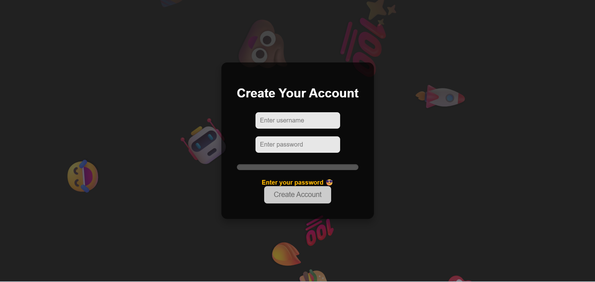
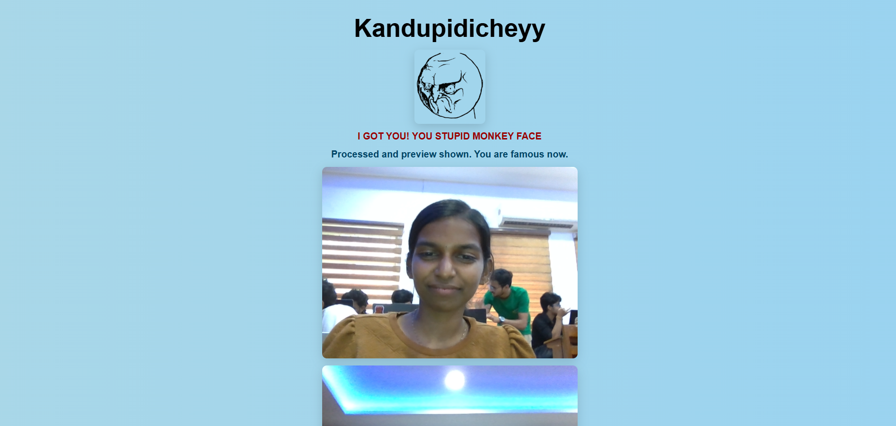

# Kandpidicheyy 🎯

## Basic Details
### Team Name: [Name]

### Team Members
- Team Lead: Sanjana.k - Government Engineering College , sreekrishnapuram , Palakkad
- Member 2: Sneha.s - Government Engineering College , sreekrishnapuram , Palakkad

### Project Description
Forget boring “weak password” warnings — here, every bad password choice gets roasted with sarcastic, over-the-top demands until you finally crack the code. And when you do… we take your victory mugshot using your webcam, just to make sure the world knows the face of the person who fought through the silliest password rules ever invented.

### The Problem (that doesn't exist)
problem of week password

### The Solution (that nobody asked for)
Instruct the user to type a strong password by pushing them

## Technical Details
### Technologies/Components Used
For Software:
- HTML,CSS
- Javascript
- Opencv
- ChatGPT

### Implementation
For Software:
# Installation

# Run
[commands]

### Project Documentation
For Software:

# Screenshots (Add at least 3)
(Add screenshot 1 here with proper name)
*Add caption explaining what this shows*

!(Add screenshot 2 here with proper name)
*Add caption explaining what this shows*

!(Add screenshot 3 here with proper name)
*Add caption explaining what this shows*

### Project Demo
# Video
<video controls src="WhatsApp Video 2025-08-09 at 04.18.19_84aa1447.mp4" title="Title"></video>
How the website works

# Additional Demos
[Add any extra demo materials/links]

## Team Contributions
- Sneha S:Web Page created using html css js
- Sanjana k: OpenCV
- 

---
Made with ❤️ at TinkerHub Useless Projects 

